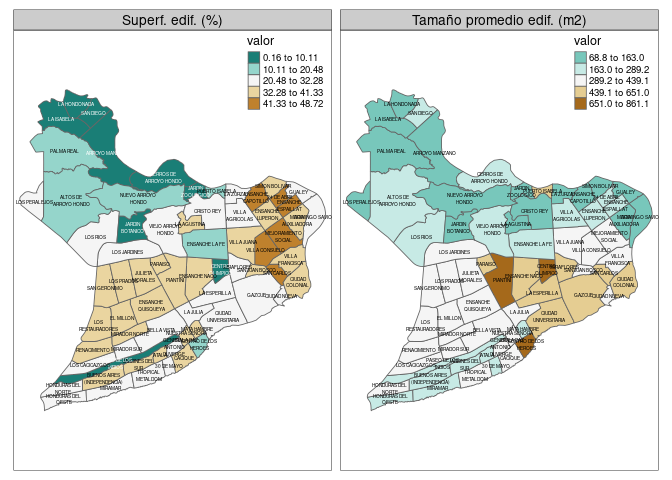
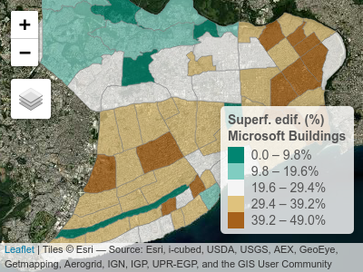
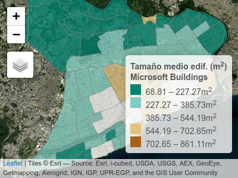

Microsoft Building Footprints, Distrito Nacional, RD
================

Superficie de edificaciones según barrios del Distrito Nacional, a
partir de la base de datos [*Microsoft Building
Footprints*](https://www.microsoft.com/en-us/maps/building-footprints) y
la división de la [Oficina Nacional de Estadística (ONE) de República
Dominicana](https://www.one.gob.do/)

``` r
library(sf)
library(stars)
library(sp)
library(tidyverse)
library(exactextractr)
library(tmap)
library(leaflet)
library(DT)
library(kableExtra)
source('wrap_labels.R')
```

``` r
# sf_use_s2(FALSE)
bp <- st_read('BPCenso2010.shp') #ONE
bpdn <- bp %>% filter(PROV == '01' & MUN == '01')
plot(bpdn)
st_write(bpdn, 'barrios_DN_ONE.gpkg')
```

``` r
mb <- st_read('Dominican Republic.geojsonl') #Microsoft Buildings (MB)
st_crs(mb) <- 4326
mbutm <- st_transform(mb, 32619)
mbdn <- st_intersection(bpdn, mbutm)
st_write(mbdn, 'microsoft_buildings_dn_utm.gpkg')
```

## Zonal stats

### stars/raster approach

``` r
template <- st_as_stars(st_bbox(mbdn), dx = 0.3, dy = 0.3, values = NA_real_)
mbdns <- st_rasterize(mbdn, template = template)
mbdnr <- as(mbdns, 'Raster')
zs <- exact_extract(mbdnr, bpdn)
```

### sf approach

``` r
bpdn <- st_read('barrios_DN_ONE.gpkg', quiet = T) #ONE
mbdn <- st_read('microsoft_buildings_dn_utm.gpkg', quiet = T) #MB, DN
zs <- mbdn %>% mutate(area = st_area(geom)) %>% group_by(BP) %>% summarise(bldg_area = sum(area))
bpdnbldg <- bpdn %>% inner_join(zs %>% st_drop_geometry)
```

    ## Joining, by = "BP"

``` r
bpdnbldg <- bpdnbldg %>%
  mutate(area = st_area(geom), prop_bldg = round(units::drop_units((bldg_area / area )*100), 2))
```

## Tables

``` r
bpdnbldg_out <- bpdnbldg %>% 
    st_drop_geometry() %>%
    dplyr::select(Barrio = TOPONIMIA, `Superf. edif. (%)` = prop_bldg) %>%
    arrange(desc(`Superf. edif. (%)`))
if(output_type == 'github_document') {
  bpdnbldg_out %>% 
  kable() %>%
  kable_styling(full_width = TRUE)
} else {
    bpdnbldg_out %>% datatable()
}
```

<table class="table" style="margin-left: auto; margin-right: auto;">
<thead>
<tr>
<th style="text-align:left;">
Barrio
</th>
<th style="text-align:right;">
Superf. edif. (%)
</th>
</tr>
</thead>
<tbody>
<tr>
<td style="text-align:left;">
24 DE ABRIL
</td>
<td style="text-align:right;">
48.72
</td>
</tr>
<tr>
<td style="text-align:left;">
VILLA CONSUELO
</td>
<td style="text-align:right;">
48.61
</td>
</tr>
<tr>
<td style="text-align:left;">
SAN CARLOS
</td>
<td style="text-align:right;">
47.90
</td>
</tr>
<tr>
<td style="text-align:left;">
ENSANCHE ESPAILLAT
</td>
<td style="text-align:right;">
45.71
</td>
</tr>
<tr>
<td style="text-align:left;">
MEJORAMIENTO SOCIAL
</td>
<td style="text-align:right;">
44.02
</td>
</tr>
<tr>
<td style="text-align:left;">
ENSANCHE CAPOTILLO
</td>
<td style="text-align:right;">
43.60
</td>
</tr>
<tr>
<td style="text-align:left;">
ATALA
</td>
<td style="text-align:right;">
41.33
</td>
</tr>
<tr>
<td style="text-align:left;">
LOS RESTAURADORES
</td>
<td style="text-align:right;">
40.88
</td>
</tr>
<tr>
<td style="text-align:left;">
NUESTRA SEÑORA DE LA PAZ
</td>
<td style="text-align:right;">
40.71
</td>
</tr>
<tr>
<td style="text-align:left;">
ENSANCHE QUISQUEYA
</td>
<td style="text-align:right;">
40.28
</td>
</tr>
<tr>
<td style="text-align:left;">
MARIA AUXILIADORA
</td>
<td style="text-align:right;">
40.06
</td>
</tr>
<tr>
<td style="text-align:left;">
SAN JUAN BOSCO
</td>
<td style="text-align:right;">
39.78
</td>
</tr>
<tr>
<td style="text-align:left;">
CIUDAD COLONIAL
</td>
<td style="text-align:right;">
39.67
</td>
</tr>
<tr>
<td style="text-align:left;">
PARAISO
</td>
<td style="text-align:right;">
39.06
</td>
</tr>
<tr>
<td style="text-align:left;">
ENSANCHE LUPERON
</td>
<td style="text-align:right;">
39.02
</td>
</tr>
<tr>
<td style="text-align:left;">
BUENOS AIRES (INDEPENDENCIA)
</td>
<td style="text-align:right;">
37.98
</td>
</tr>
<tr>
<td style="text-align:left;">
MATA HAMBRE
</td>
<td style="text-align:right;">
37.92
</td>
</tr>
<tr>
<td style="text-align:left;">
MIRADOR NORTE
</td>
<td style="text-align:right;">
37.57
</td>
</tr>
<tr>
<td style="text-align:left;">
EL MILLON
</td>
<td style="text-align:right;">
37.18
</td>
</tr>
<tr>
<td style="text-align:left;">
ENSANCHE NACO
</td>
<td style="text-align:right;">
36.98
</td>
</tr>
<tr>
<td style="text-align:left;">
VILLA FRANCISCA
</td>
<td style="text-align:right;">
36.93
</td>
</tr>
<tr>
<td style="text-align:left;">
CACIQUE
</td>
<td style="text-align:right;">
36.84
</td>
</tr>
<tr>
<td style="text-align:left;">
PIANTINI
</td>
<td style="text-align:right;">
36.06
</td>
</tr>
<tr>
<td style="text-align:left;">
JULIETA MORALES
</td>
<td style="text-align:right;">
35.76
</td>
</tr>
<tr>
<td style="text-align:left;">
JARDINES DEL SUR
</td>
<td style="text-align:right;">
35.72
</td>
</tr>
<tr>
<td style="text-align:left;">
LOS PRADOS
</td>
<td style="text-align:right;">
35.68
</td>
</tr>
<tr>
<td style="text-align:left;">
SIMON BOLIVAR
</td>
<td style="text-align:right;">
35.25
</td>
</tr>
<tr>
<td style="text-align:left;">
VILLA JUANA
</td>
<td style="text-align:right;">
34.26
</td>
</tr>
<tr>
<td style="text-align:left;">
SAN GERONIMO
</td>
<td style="text-align:right;">
33.64
</td>
</tr>
<tr>
<td style="text-align:left;">
LA AGUSTINA
</td>
<td style="text-align:right;">
33.41
</td>
</tr>
<tr>
<td style="text-align:left;">
RENACIMIENTO
</td>
<td style="text-align:right;">
33.20
</td>
</tr>
<tr>
<td style="text-align:left;">
LOS CACICAZGOS
</td>
<td style="text-align:right;">
32.28
</td>
</tr>
<tr>
<td style="text-align:left;">
30 DE MAYO
</td>
<td style="text-align:right;">
32.15
</td>
</tr>
<tr>
<td style="text-align:left;">
LA ESPERILLA
</td>
<td style="text-align:right;">
31.42
</td>
</tr>
<tr>
<td style="text-align:left;">
BELLA VISTA
</td>
<td style="text-align:right;">
31.40
</td>
</tr>
<tr>
<td style="text-align:left;">
HONDURAS DEL NORTE
</td>
<td style="text-align:right;">
30.83
</td>
</tr>
<tr>
<td style="text-align:left;">
GUALEY
</td>
<td style="text-align:right;">
30.49
</td>
</tr>
<tr>
<td style="text-align:left;">
CIUDAD NUEVA
</td>
<td style="text-align:right;">
30.47
</td>
</tr>
<tr>
<td style="text-align:left;">
GAZCUE
</td>
<td style="text-align:right;">
30.39
</td>
</tr>
<tr>
<td style="text-align:left;">
MIRAFLORES
</td>
<td style="text-align:right;">
30.19
</td>
</tr>
<tr>
<td style="text-align:left;">
MIRADOR SUR
</td>
<td style="text-align:right;">
29.82
</td>
</tr>
<tr>
<td style="text-align:left;">
LA ZURZA
</td>
<td style="text-align:right;">
29.48
</td>
</tr>
<tr>
<td style="text-align:left;">
GENERAL ANTONIO DUVERGE
</td>
<td style="text-align:right;">
29.40
</td>
</tr>
<tr>
<td style="text-align:left;">
LOS RIOS
</td>
<td style="text-align:right;">
29.20
</td>
</tr>
<tr>
<td style="text-align:left;">
LA JULIA
</td>
<td style="text-align:right;">
28.41
</td>
</tr>
<tr>
<td style="text-align:left;">
DOMINGO SAVIO
</td>
<td style="text-align:right;">
28.29
</td>
</tr>
<tr>
<td style="text-align:left;">
LOS PERALEJOS
</td>
<td style="text-align:right;">
27.11
</td>
</tr>
<tr>
<td style="text-align:left;">
MIRAMAR
</td>
<td style="text-align:right;">
26.59
</td>
</tr>
<tr>
<td style="text-align:left;">
VIEJO ARROYO HONDO
</td>
<td style="text-align:right;">
26.36
</td>
</tr>
<tr>
<td style="text-align:left;">
CIUDAD UNIVERSITARIA
</td>
<td style="text-align:right;">
25.83
</td>
</tr>
<tr>
<td style="text-align:left;">
LOS JARDINES
</td>
<td style="text-align:right;">
25.41
</td>
</tr>
<tr>
<td style="text-align:left;">
VILLA AGRICOLAS
</td>
<td style="text-align:right;">
25.01
</td>
</tr>
<tr>
<td style="text-align:left;">
HONDURAS DEL OESTE
</td>
<td style="text-align:right;">
24.94
</td>
</tr>
<tr>
<td style="text-align:left;">
TROPICAL METALDOM
</td>
<td style="text-align:right;">
24.91
</td>
</tr>
<tr>
<td style="text-align:left;">
CRISTO REY
</td>
<td style="text-align:right;">
24.78
</td>
</tr>
<tr>
<td style="text-align:left;">
ENSANCHE LA FE
</td>
<td style="text-align:right;">
20.48
</td>
</tr>
<tr>
<td style="text-align:left;">
NUEVO ARROYO HONDO
</td>
<td style="text-align:right;">
19.48
</td>
</tr>
<tr>
<td style="text-align:left;">
CENTRO DE LOS HEROES
</td>
<td style="text-align:right;">
17.78
</td>
</tr>
<tr>
<td style="text-align:left;">
ALTOS DE ARROYO HONDO
</td>
<td style="text-align:right;">
17.51
</td>
</tr>
<tr>
<td style="text-align:left;">
PUERTO ISABELA
</td>
<td style="text-align:right;">
16.67
</td>
</tr>
<tr>
<td style="text-align:left;">
PALMA REAL
</td>
<td style="text-align:right;">
13.65
</td>
</tr>
<tr>
<td style="text-align:left;">
CERROS DE ARROYO HONDO
</td>
<td style="text-align:right;">
10.11
</td>
</tr>
<tr>
<td style="text-align:left;">
CENTRO OLIMPICO
</td>
<td style="text-align:right;">
7.98
</td>
</tr>
<tr>
<td style="text-align:left;">
ARROYO MANZANO
</td>
<td style="text-align:right;">
6.67
</td>
</tr>
<tr>
<td style="text-align:left;">
LA ISABELA
</td>
<td style="text-align:right;">
5.10
</td>
</tr>
<tr>
<td style="text-align:left;">
LA HONDONADA
</td>
<td style="text-align:right;">
2.04
</td>
</tr>
<tr>
<td style="text-align:left;">
PASEO DE LOS INDIOS
</td>
<td style="text-align:right;">
0.85
</td>
</tr>
<tr>
<td style="text-align:left;">
JARDIN ZOOLOGICO
</td>
<td style="text-align:right;">
0.67
</td>
</tr>
<tr>
<td style="text-align:left;">
JARDIN BOTANICO
</td>
<td style="text-align:right;">
0.46
</td>
</tr>
<tr>
<td style="text-align:left;">
SAN DIEGO
</td>
<td style="text-align:right;">
0.16
</td>
</tr>
</tbody>
</table>

## Plots

### ggplot2

``` r
bpdnbldg %>% ggplot + aes(fill = prop_bldg, label = TOPONIMIA) + geom_sf(lwd = 0.1) +
  geom_sf_text(size = 1.5) + scale_fill_distiller(palette = "BrBG") + theme_bw()
```



### tmap

``` r
bpdnbldg %>% mutate(TOPONIMIA2 = wrap.labels(TOPONIMIA, 15)) %>%
  tm_shape() + tm_fill(col = 'prop_bldg', palette = '-BrBG', title = 'Superficie\nEdificaciones (%)') +
  tm_borders() + tm_text('TOPONIMIA2', size = 0.35)
```



### leaflet

-   Versión interactiva
    [aquí](https://geofis.github.io/mbf-dn-rd/README.html)

``` r
bpdnbldg4326 <- st_transform(bpdnbldg, 4326)
pal <- colorNumeric(
  palette = "BrBG",
  domain = bpdnbldg4326$prop_bldg,
  reverse = T
)
pal <- colorBin(
  palette = "BrBG",
  bins = 5,
  domain = bpdnbldg4326$prop_bldg,
  reverse = T
)
bpdnbldg4326 %>% leaflet() %>% 
  addTiles(group = 'OSM') %>%
  addProviderTiles("Esri.NatGeoWorldMap", group="ESRI Mapa") %>%
  addProviderTiles("Esri.WorldImagery", group="ESRI Imagen") %>%
  addProviderTiles("CartoDB.Positron", group= "CartoDB") %>%
  addLayersControl(
    position = 'topleft',
    overlayGroups = 'Superf. edif. (%)<br>Microsoft Buildings',
    baseGroups = c("ESRI Imagen", "OSM", "ESRI Mapa", "CartoDB")) %>%
  addPolygons(group = 'Superf. edif. (%)<br>Microsoft Buildings',
              fillColor = ~pal(prop_bldg), smoothFactor = 0.2, fillOpacity = 0.75,
              stroke = TRUE, weight = 1, color = 'grey', label = ~TOPONIMIA,
              popup = paste0("<b>BP: </b>",
                             bpdnbldg4326$TOPONIMIA,
                             "<br>",
                             "<b>Superf. edif. (%): </b>",
                             bpdnbldg4326$prop_bldg),
              labelOptions = labelOptions(
                style = list("font-weight" = "normal", padding = "3px 8px",
                             textsize = "15px", direction = "auto")),
              highlightOptions = highlightOptions(color = "#10539A",
                                                  weight = 3, fillColor = NA
               ),
              popupOptions = popupOptions(closeOnClick = TRUE)) %>% 
  addLegend("bottomright", pal = pal, values = ~prop_bldg,
    title = "Superf. edif. (%)<br>Microsoft Buildings",
    labFormat = labelFormat(suffix = "%"),
    opacity = 1) %>% 
  setView(
    lat = mean(st_bbox(bpdnbldg4326)[c(2,4)])-0.015,
    lng = mean(st_bbox(bpdnbldg4326)[c(1,3)]), zoom=12) %>% 
  suppressWarnings()
```


