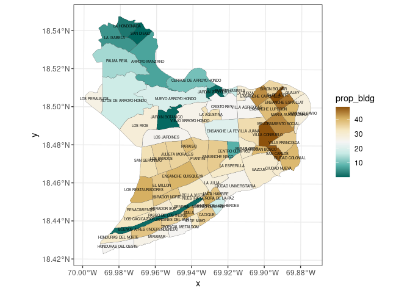

Microsoft Building Footprints, Distrito Nacional, RD
================

Superficie de edificaciones según barrios del Distrito Nacional, a
partir de la base de datos [*Microsoft Building
Footprints*](https://www.microsoft.com/en-us/maps/building-footprints) y
la división de la [Oficina Nacional de Estadística (ONE) de República
Dominicana](https://www.one.gob.do/)

``` r
library(sf)
library(stars)
library(sp)
library(tidyverse)
library(exactextractr)
library(tmap)
library(leaflet)
source('wrap_labels.R')
```

``` r
# sf_use_s2(FALSE)
bp <- st_read('BPCenso2010.shp') #ONE
bpdn <- bp %>% filter(PROV == '01' & MUN == '01')
plot(bpdn)
st_write(bpdn, 'barrios_DN_ONE.gpkg')
```

``` r
mb <- st_read('Dominican Republic.geojsonl') #Microsoft Buildings (MB)
st_crs(mb) <- 4326
mbutm <- st_transform(mb, 32619)
mbdn <- st_intersection(bpdn, mbutm)
st_write(mbdn, 'microsoft_buildings_dn_utm.gpkg')
```

## Zonal stats

### stars/raster approach

``` r
template <- st_as_stars(st_bbox(mbdn), dx = 0.3, dy = 0.3, values = NA_real_)
mbdns <- st_rasterize(mbdn, template = template)
mbdnr <- as(mbdns, 'Raster')
zs <- exact_extract(mbdnr, bpdn)
```

### sf approach

``` r
bpdn <- st_read('barrios_DN_ONE.gpkg', quiet = T) #ONE
mbdn <- st_read('microsoft_buildings_dn_utm.gpkg', quiet = T) #MB, DN
mbdn
```

    ## Simple feature collection with 97256 features and 10 fields
    ## Geometry type: GEOMETRY
    ## Dimension:     XY
    ## Bounding box:  xmin: 394548.9 ymin: 2037329 xmax: 407570.8 ymax: 2050611
    ## Projected CRS: WGS 84 / UTM zone 19N
    ## First 10 features:
    ##    PROV MUN DM SECC  BP             TOPONIMIA REG ZONA        ENLACE
    ## 1    01  01 01   01 062     MARIA AUXILIADORA  10    1 1001010101062
    ## 2    01  01 01   01 046            CRISTO REY  10    1 1001010101046
    ## 3    01  01 01   01 003        ARROYO MANZANO  10    1 1001010101003
    ## 4    01  01 01   01 062     MARIA AUXILIADORA  10    1 1001010101062
    ## 5    01  01 01   01 056        VILLA CONSUELO  10    1 1001010101056
    ## 6    01  01 01   01 058    ENSANCHE CAPOTILLO  10    1 1001010101058
    ## 7    01  01 01   01 053                GAZCUE  10    1 1001010101053
    ## 8    01  01 01   01 004 ALTOS DE ARROYO HONDO  10    1 1001010101004
    ## 9    01  01 01   01 001         LOS PERALEJOS  10    1 1001010101001
    ## 10   01  01 01   01 005              LOS RIOS  10    1 1001010101005
    ##            CODIGO                           geom
    ## 1  10010101101062 POLYGON ((406254.7 2045632,...
    ## 2  10010101101046 POLYGON ((402811 2045939, 4...
    ## 3  10010101101003 POLYGON ((399117.1 2047661,...
    ## 4  10010101101062 POLYGON ((406698.8 2045644,...
    ## 5  10010101101056 POLYGON ((404925.7 2043671,...
    ## 6  10010101101058 POLYGON ((404355.7 2046533,...
    ## 7  10010101101053 POLYGON ((404250.6 2042560,...
    ## 8  10010101101004 POLYGON ((395579.2 2045902,...
    ## 9  10010101101001 POLYGON ((395309.3 2046418,...
    ## 10 10010101101005 POLYGON ((397395.4 2044583,...

``` r
zs <- mbdn %>% mutate(area = st_area(geom)) %>% group_by(BP) %>% summarise(bldg_area = sum(area))
bpdnbldg <- bpdn %>% inner_join(zs %>% st_drop_geometry)
```

    ## Joining, by = "BP"

``` r
bpdnbldg <- bpdnbldg %>%
  mutate(area = st_area(geom), prop_bldg = round(units::drop_units((bldg_area / area )*100), 2))
bpdnbldg
```

    ## Simple feature collection with 70 features and 13 fields
    ## Geometry type: MULTIPOLYGON
    ## Dimension:     XY
    ## Bounding box:  xmin: 394514.9 ymin: 2037241 xmax: 407670.6 ymax: 2051052
    ## Projected CRS: WGS 84 / UTM zone 19N
    ## First 10 features:
    ##    PROV MUN DM SECC  BP                TOPONIMIA REG ZONA        ENLACE
    ## 1    01  01 01   01 007       HONDURAS DEL OESTE  10    1 1001010101007
    ## 2    01  01 01   01 026                  MIRAMAR  10    1 1001010101026
    ## 3    01  01 01   01 027        TROPICAL METALDOM  10    1 1001010101027
    ## 4    01  01 01   01 036               30 DE MAYO  10    1 1001010101036
    ## 5    01  01 01   01 037                  CACIQUE  10    1 1001010101037
    ## 6    01  01 01   01 039              MATA HAMBRE  10    1 1001010101039
    ## 7    01  01 01   01 038     CENTRO DE LOS HEROES  10    1 1001010101038
    ## 8    01  01 01   01 034 NUESTRA SEÑORA DE LA PAZ  10    1 1001010101034
    ## 9    01  01 01   01 035  GENERAL ANTONIO DUVERGE  10    1 1001010101035
    ## 10   01  01 01   01 029                    ATALA  10    1 1001010101029
    ##            CODIGO       bldg_area                           geom
    ## 1  10010101101007 202989.85 [m^2] MULTIPOLYGON (((397387.3 20...
    ## 2  10010101101026 277454.23 [m^2] MULTIPOLYGON (((397366.8 20...
    ## 3  10010101101027 253466.63 [m^2] MULTIPOLYGON (((399318.4 20...
    ## 4  10010101101036 108052.70 [m^2] MULTIPOLYGON (((400640.8 20...
    ## 5  10010101101037 268067.17 [m^2] MULTIPOLYGON (((401024.2 20...
    ## 6  10010101101039 121840.70 [m^2] MULTIPOLYGON (((401793.8 20...
    ## 7  10010101101038  92138.79 [m^2] MULTIPOLYGON (((401764 2040...
    ## 8  10010101101034 137652.19 [m^2] MULTIPOLYGON (((401793.8 20...
    ## 9  10010101101035 105990.63 [m^2] MULTIPOLYGON (((400817.2 20...
    ## 10 10010101101029 129865.36 [m^2] MULTIPOLYGON (((400212.7 20...
    ##               area prop_bldg
    ## 1   813809.8 [m^2]     24.94
    ## 2  1043336.2 [m^2]     26.59
    ## 3  1017606.1 [m^2]     24.91
    ## 4   336135.8 [m^2]     32.15
    ## 5   727581.3 [m^2]     36.84
    ## 6   321304.7 [m^2]     37.92
    ## 7   518178.8 [m^2]     17.78
    ## 8   338164.4 [m^2]     40.71
    ## 9   360545.3 [m^2]     29.40
    ## 10  314244.0 [m^2]     41.33

## Plots

### ggplot2

``` r
bpdnbldg %>% ggplot + aes(fill = prop_bldg, label = TOPONIMIA) + geom_sf(lwd = 0.1) +
  geom_sf_text(size = 1.5) + scale_fill_distiller(palette = "BrBG") + theme_bw()
```



### tmap

``` r
bpdnbldg %>% mutate(TOPONIMIA2 = wrap.labels(TOPONIMIA, 15)) %>%
  tm_shape() + tm_fill(col = 'prop_bldg', palette = '-BrBG', title = 'Superficie\nEdificaciones (%)') +
  tm_borders() + tm_text('TOPONIMIA2', size = 0.35)
```


### leaflet

-   Versión interactiva
    [aquí](https://geofis.github.io/mbf-dn-rd/README.html)

``` r
bpdnbldg4326 <- st_transform(bpdnbldg, 4326)
pal <- colorNumeric(
  palette = "BrBG",
  domain = bpdnbldg4326$prop_bldg,
  reverse = T
)
pal <- colorBin(
  palette = "BrBG",
  bins = 5,
  domain = bpdnbldg4326$prop_bldg,
  reverse = T
)
bpdnbldg4326 %>% leaflet() %>% 
  addTiles(group = 'OSM') %>%
  addProviderTiles("Esri.NatGeoWorldMap", group="ESRI Mapa") %>%
  addProviderTiles("Esri.WorldImagery", group="ESRI Imagen") %>%
  addProviderTiles("CartoDB.Positron", group= "CartoDB") %>%
  addLayersControl(
    position = 'topleft',
    overlayGroups = 'Superf. edif. (%)<br>Microsoft Buildings',
    baseGroups = c("ESRI Imagen", "OSM", "ESRI Mapa", "CartoDB")) %>%
  addPolygons(group = 'Superf. edif. (%)<br>Microsoft Buildings',
              fillColor = ~pal(prop_bldg), smoothFactor = 0.2, fillOpacity = 0.75,
              stroke = TRUE, weight = 1, color = 'grey', label = ~TOPONIMIA,
              popup = paste0("<b>BP: </b>",
                             bpdnbldg4326$TOPONIMIA,
                             "<br>",
                             "<b>Superf. edif. (%): </b>",
                             bpdnbldg4326$prop_bldg),
              labelOptions = labelOptions(
                style = list("font-weight" = "normal", padding = "3px 8px",
                             textsize = "15px", direction = "auto")),
              highlightOptions = highlightOptions(color = "#10539A",
                                                  weight = 3, fillColor = NA
               ),
              popupOptions = popupOptions(closeOnClick = TRUE)) %>% 
  addLegend("bottomright", pal = pal, values = ~prop_bldg,
    title = "Superf. edif. (%)<br>Microsoft Buildings",
    labFormat = labelFormat(suffix = "%"),
    opacity = 1) %>% 
  setView(
    lat = mean(st_bbox(bpdnbldg4326)[c(2,4)])-0.015,
    lng = mean(st_bbox(bpdnbldg4326)[c(1,3)]), zoom=12) %>% 
  suppressWarnings()
```


